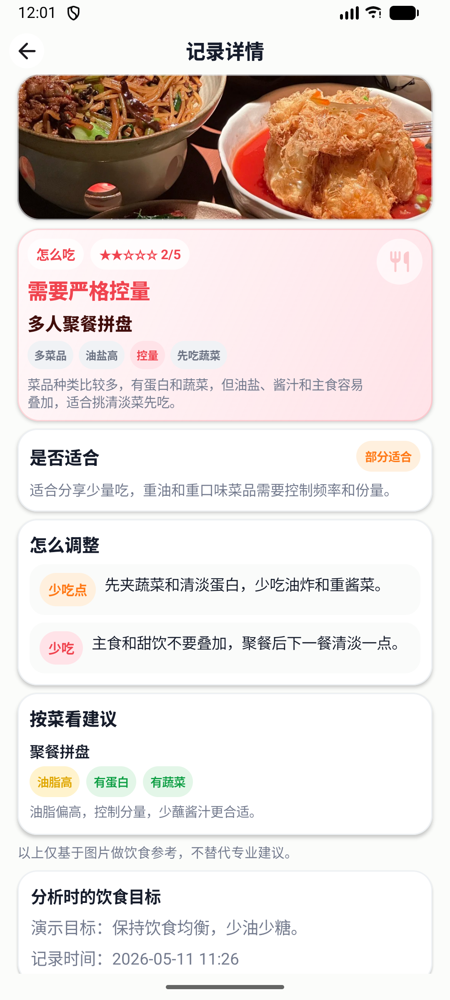
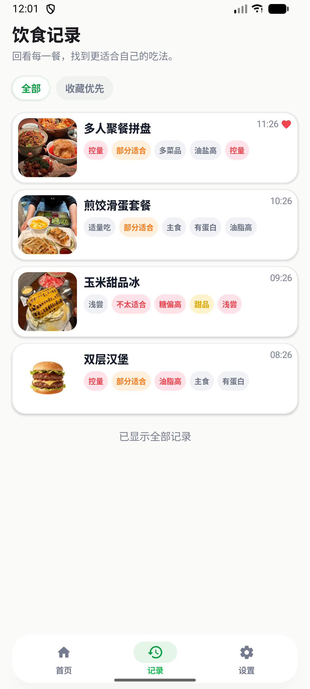
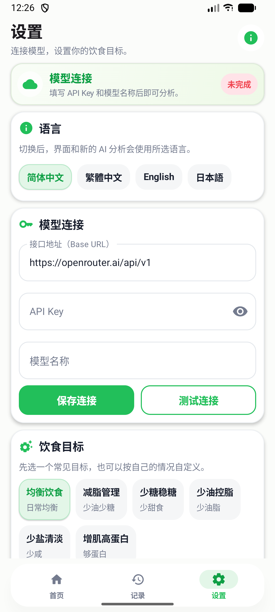

# 吃得明白 EatWise

吃得明白是一个个人实验性的 Android 饮食拍照分析 App。它不做登录、后端或云同步，只负责图片输入、AI 请求、结果展示和本地历史保存。

## 功能

- 配置 OpenAI-compatible API：Base URL、模型名称、API Key、个人饮食目标
- 支持简体中文、繁体中文、英语和日语，界面、新分析结果、AI prompt、建议和标签会随语言切换
- 设置页内置常见饮食目标预设，如均衡饮食、减脂、少糖、少油、少盐和增肌，并支持自定义目标自动保存
- 导入相册餐食图片或使用 CameraX 拍照
- 首次使用且暂无历史记录时提供示例图片，可直接点击体验分析链路
- 压缩图片后发送给用户配置的模型
- 展示餐食名称、怎么吃、1~5 星参考、是否适合目标、怎么调整、按菜看建议和短标签
- 支持多个菜品或复合食材的分析结果展示，按菜品给出 2~3 个标签和简短建议
- 分析等待页展示阶段进度、分析请求、实时返回和滚动提示，并允许返回首页后台继续分析
- 分析成功后自动保存本地历史记录，支持查看详情、收藏和删除
- 历史记录使用紧凑移动端卡片，左滑可收藏或删除
- 未填写 Key、模型不支持图片、网络失败、JSON 解析失败等场景有明确提示

## 界面预览

以下截图使用内置测试图片和合成分析记录生成，不包含真实用户照片、API Key 或个人饮食目标。

| 首页 | 详情页 |
|---|---|
|  |  |

| 记录页 | 设置页 |
|---|---|
|  |  |

## 技术栈

- Kotlin
- Jetpack Compose + Material 3
- Navigation Compose
- DataStore Preferences
- Room
- OkHttp
- kotlinx.serialization
- Coil
- CameraX

## 运行

1. 用 Android Studio 打开项目。
2. 确认本机 Android SDK 可用。
3. 运行：

```powershell
.\gradlew.bat test
.\gradlew.bat assembleDebug
```

更完整的编译、Debug 和日志采集流程见 [docs/MAINTENANCE.md](docs/MAINTENANCE.md)。

如果命令行提示 `JAVA_HOME` 未设置，可以临时使用 Android Studio 自带 JDK：

```powershell
$env:JAVA_HOME='C:\Program Files\Android\Android Studio\jbr'
.\gradlew.bat assembleDebug
```

## 配置模型

默认 Base URL：

```text
https://openrouter.ai/api/v1
```

需要在设置页填写：

- API Key
- 支持图片输入的模型名称
- 用户饮食目标

设置页的“测试连接”会发送一张内置测试图片，用于确认当前模型确实支持视觉输入。

App 会请求：

```text
POST {baseUrl}/chat/completions
```

## 隐私说明

- API Key 只保存在本机 DataStore 中。
- App 不打印 API Key、Authorization header 或完整 base64 图片内容。
- 图片保存到 App 私有目录。
- Android 系统备份已关闭，避免把本地 Key、图片和分析记录同步到云端或新设备。
- 除用户配置的大模型 API 外，App 不上传数据到其他服务。

## 工程治理

- AI prompt 集中在 `OpenAiCompatibleClient`，当前 `promptVersion = 9`。
- AI 约束、输出 schema、标签语义和隐私边界见 [docs/AI_GOVERNANCE.md](docs/AI_GOVERNANCE.md)。
- 结果 JSON 以当前 schema 为准，避免为废弃字段保留兼容分支。
- 提交代码前运行 `.\gradlew.bat test assembleDebug`，UI 改动需补充真机或模拟器截图验收。
- 发布正式包前运行 `.\gradlew.bat lintDebug test assembleRelease` 并验证 APK 签名。
- 贡献流程见 [CONTRIBUTING.md](CONTRIBUTING.md)。
- 协作行为准则见 [CODE_OF_CONDUCT.md](CODE_OF_CONDUCT.md)。
- 安全边界和报告方式见 [SECURITY.md](SECURITY.md)。
- 变更记录见 [CHANGELOG.md](CHANGELOG.md)。
- 编译、Debug、日志采集和 AI 接手维护流程见 [docs/MAINTENANCE.md](docs/MAINTENANCE.md)。
- AI 代理维护约束见 [AGENTS.md](AGENTS.md)。

## 开源许可证

本项目使用 [MIT License](LICENSE)。

## 常见错误

- “请先在设置中填写 API Key”：设置页未填写 Key。
- “请先在设置中填写模型名称”：设置页未填写模型。
- “这个模型可能看不了图片”：请更换支持图片输入的模型。
- “结果格式异常”：模型没有稳定返回 JSON，可更换模型或重试。
- “请求失败”：检查网络、Base URL 或模型设置。
