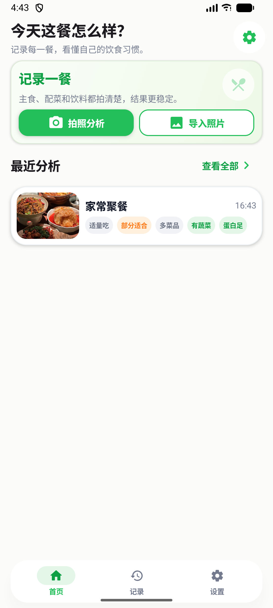
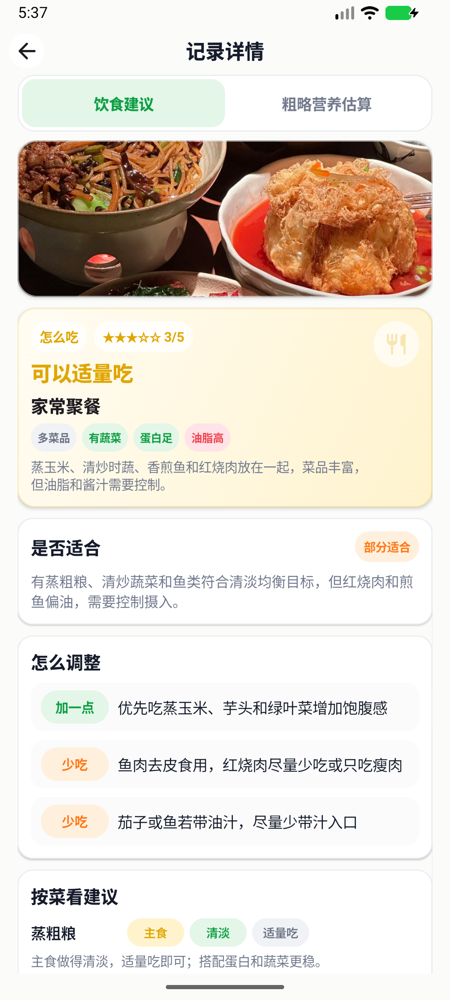
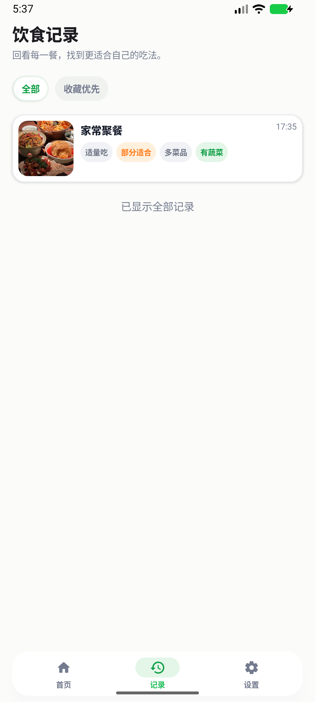
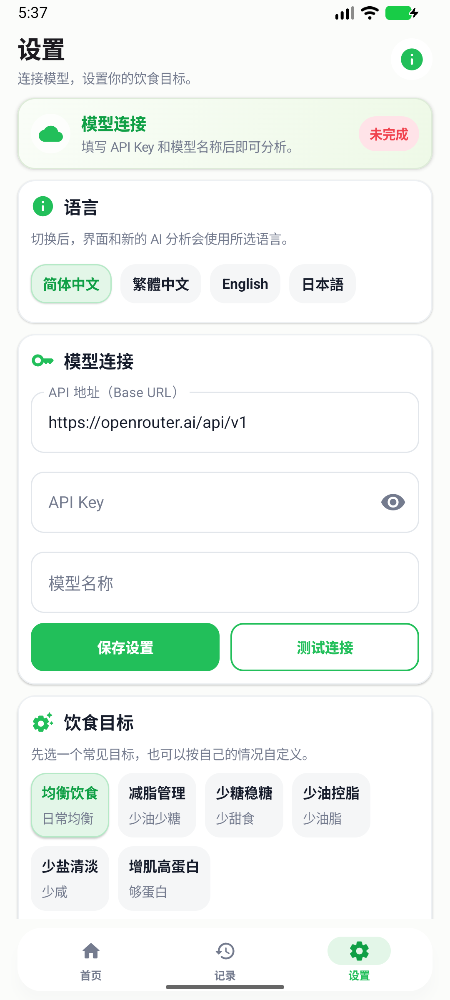
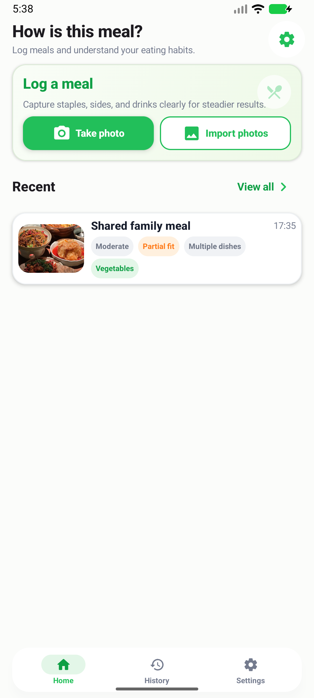
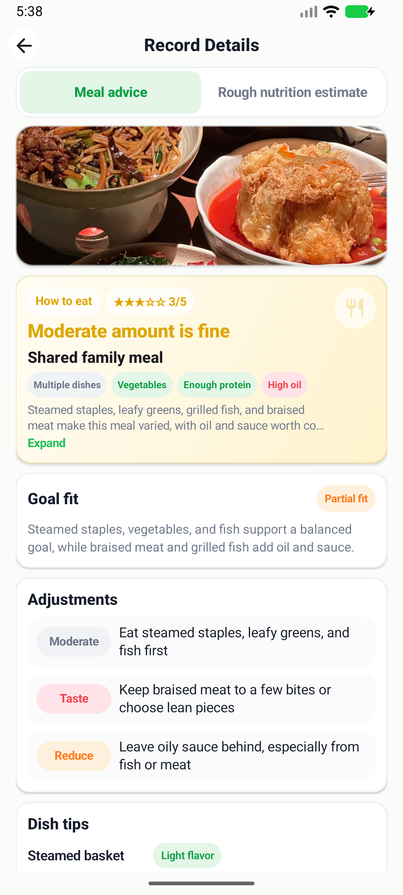
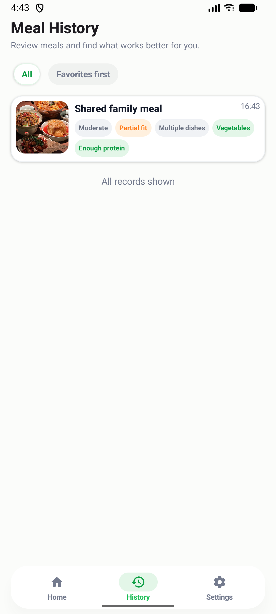
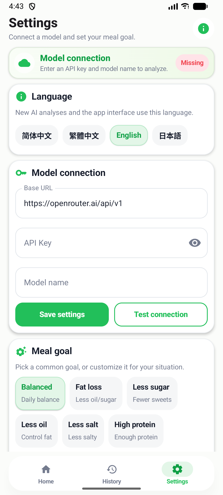

# 吃得明白 EatWise

[中文](#中文) | [English](#english)

## 中文

吃得明白是一个个人实验性的 Android 饮食拍照分析 App。它不做登录、后端或云同步，只负责图片输入、AI 请求、结果展示和本地历史保存。

### 功能

- 配置 OpenAI-compatible API：Base URL、模型名称、API Key、个人饮食目标
- 支持简体中文、繁体中文、英语和日语，界面、新分析结果、AI prompt、建议和标签会随语言切换
- 首次启动按系统默认语言选择初始语言，用户也可以在设置页手动切换
- 设置页内置常见饮食目标预设，如均衡饮食、减脂、少糖、少油、少盐和增肌，并支持自定义目标自动保存
- 设置页集中展示模型连接状态、语言切换、API 配置和饮食目标预设
- 导入相册餐食图片或使用 CameraX 拍照，相册支持一次选择多张图片
- 首页提供拍照分析、导入照片和最近分析入口，底部导航可在首页、记录和设置之间切换
- 多张图片会按顺序排队分析，新任务不会中断当前任务；失败任务可从首页或详情页重试
- 首次使用且暂无历史记录时提供示例图片，可直接点击体验分析链路
- 压缩图片后发送给用户配置的模型
- 展示餐食名称、怎么吃、1~5 星参考、是否适合目标、怎么调整、按菜看建议和短标签
- 同一张图片会并发生成饮食建议卡片和粗略营养估算卡片；热量和克数只显示宽区间、直观食物类比和估算依据，不作为称重记录
- 两张结果卡片以可点击、可左右滑动的 Tab 展示，并分别保留自己的上下滚动位置，减少切换闪烁和长短内容切换空白
- 支持多个菜品或复合食材的分析结果展示，总体评价基于整盘或整桌菜，按菜品给出 2~3 个标签和更具体的简短建议
- 分析等待页展示阶段进度、分析请求、实时返回和滚动提示，并允许返回首页后台继续分析
- 大模型流式请求使用较长读取超时和轻量自动重试，降低短暂退后台或临时网络抖动导致的失败概率
- 分析成功后自动保存本地历史记录，支持查看详情、收藏和删除
- 饮食记录页支持全部 / 收藏优先切换，紧凑卡片展示缩略图、时间和决策标签，左滑可收藏或删除
- 未填写 Key、模型不支持图片、网络失败、JSON 解析失败等场景有明确提示

### 界面预览

以下中文截图展示最新版首页、记录详情、饮食记录和设置页，使用内置测试图片和合成分析记录生成，不包含真实用户照片、API Key 或个人饮食目标。

| 首页 | 记录详情 |
|---|---|
|  |  |

| 饮食记录 | 设置 |
|---|---|
|  |  |

### 技术栈

- Kotlin
- Jetpack Compose + Material 3
- Navigation Compose
- DataStore Preferences
- Room
- OkHttp
- kotlinx.serialization
- Coil
- CameraX

### 运行

1. 用 Android Studio 打开项目。
2. 确认本机 Android SDK 可用。
3. 运行：

```powershell
.\gradlew.bat test
.\gradlew.bat assembleDebug
```

更完整的编译、Debug 和日志采集流程见 [docs/MAINTENANCE.md](docs/MAINTENANCE.md)。

如果命令行提示 `JAVA_HOME` 未设置，可以临时使用 Android Studio 自带 JDK：

```powershell
$env:JAVA_HOME='C:\Program Files\Android\Android Studio\jbr'
.\gradlew.bat assembleDebug
```

### 配置模型

默认 Base URL：

```text
https://openrouter.ai/api/v1
```

需要在设置页填写：

- API Key
- 支持图片输入的模型名称
- 用户饮食目标

设置页的“测试连接”会发送一张内置测试图片，用于确认当前模型确实支持视觉输入。

App 会请求：

```text
POST {baseUrl}/chat/completions
```

每张图片默认会并发发送两次请求：一次生成饮食建议卡片，一次生成粗略营养估算卡片。两张卡片独立显示加载和失败状态。

### 隐私说明

- API Key 只保存在本机 DataStore 中。
- App 不打印 API Key、Authorization header 或完整 base64 图片内容。
- 图片保存到 App 私有目录。
- Android 系统备份已关闭，避免把本地 Key、图片和分析记录同步到云端或新设备。
- 除用户配置的大模型 API 外，App 不上传数据到其他服务。

### 工程治理

- AI prompt 集中在 `OpenAiCompatibleClient`，当前 `promptVersion = 23`。
- AI 约束、输出 schema、标签语义和隐私边界见 [docs/AI_GOVERNANCE.md](docs/AI_GOVERNANCE.md)。
- 结果 JSON 以当前 schema 为准，避免为废弃字段保留兼容分支。
- 提交代码前运行 `.\gradlew.bat test assembleDebug`，UI 改动需补充真机或模拟器截图验收。
- 发布正式包前运行 `.\gradlew.bat lintDebug test assembleRelease` 并验证 APK 签名。
- 贡献流程见 [CONTRIBUTING.md](CONTRIBUTING.md)。
- 协作行为准则见 [CODE_OF_CONDUCT.md](CODE_OF_CONDUCT.md)。
- 安全边界和报告方式见 [SECURITY.md](SECURITY.md)。
- 变更记录见 [CHANGELOG.md](CHANGELOG.md)。
- 编译、Debug、日志采集和 AI 接手维护流程见 [docs/MAINTENANCE.md](docs/MAINTENANCE.md)。
- AI 代理维护约束见 [AGENTS.md](AGENTS.md)。

### 常见错误

- “请先在设置中填写 API Key”：设置页未填写 Key。
- “请先在设置中填写模型名称”：设置页未填写模型。
- “这个模型可能看不了图片”：请更换支持图片输入的模型。
- “结果格式异常”：模型没有稳定返回 JSON，可更换模型或重试。
- “请求失败”或“网络或模型服务临时中断”：检查网络、Base URL 或模型设置，回到前台后重试。

## English

EatWise is a personal experimental Android app for photo-based meal analysis. It has no login, backend, or cloud sync. It only handles image input, AI requests, result presentation, and local history.

### Features

- Configure an OpenAI-compatible API: Base URL, model name, API key, and personal meal goal
- Supports Simplified Chinese, Traditional Chinese, English, and Japanese for the interface, new analysis results, AI prompts, suggestions, and tags
- Uses the system language on first launch, while still allowing manual language selection in Settings
- Built-in meal goal presets such as balanced eating, fat loss, less sugar, less oil, less salt, and high protein; custom goals save automatically
- Settings brings together model connection status, language selection, API configuration, and meal goal presets
- Import meal photos from the gallery or take photos with CameraX; gallery import supports selecting multiple photos at once
- Home provides quick actions for taking or importing meal photos, shows recent analyses, and uses bottom navigation for Home, History, and Settings
- Multiple photos are analyzed in order, new tasks do not interrupt the current task, and failed tasks can be retried from Home or the analysis screen
- Shows sample photos on first use when there is no history, so the analysis flow can be previewed quickly
- Compresses images before sending them to the user-configured model
- Shows meal name, eating advice, 1-5 star reference, goal fit, adjustment tips, dish-level advice, and short tags
- Generates a meal advice card and a rough nutrition estimate card in parallel for the same photo; calorie and gram values are broad ranges with familiar food comparisons and estimate basis, not weighed records
- The two result cards are shown as tappable and horizontally swipeable tabs, each keeping its own vertical scroll position to reduce tab flicker and large blank areas when switching between different content heights
- Supports multi-dish and mixed-meal analysis, with the overall judgment based on the whole plate or table, plus 2-3 tags and a more specific concise suggestion per dish
- The waiting screen shows stage progress, request preview, streaming model output, and rotating tips; analysis can continue in the background after returning home
- Streaming model requests use a longer read timeout and light automatic retries to reduce failures after brief backgrounding or transient network drops
- Successful analyses are saved automatically to local history, with detail view, favorite, and delete actions
- Meal History supports All / Favorites first filters, with compact cards showing thumbnails, time, and decision tags; cards also support swipe actions for favorite and delete
- Clear messages are shown for missing keys, image-incompatible models, network failures, and JSON parsing failures

### Screenshots

These English screenshots show the latest Home, Record Details, Meal History, and Settings screens. They use built-in test images and synthetic analysis records, and do not contain real user photos, API keys, or personal meal goals.

| Home | Record Details |
|---|---|
|  |  |

| Meal History | Settings |
|---|---|
|  |  |

### Tech Stack

- Kotlin
- Jetpack Compose + Material 3
- Navigation Compose
- DataStore Preferences
- Room
- OkHttp
- kotlinx.serialization
- Coil
- CameraX

### Run Locally

1. Open the project in Android Studio.
2. Make sure the Android SDK is available.
3. Run:

```powershell
.\gradlew.bat test
.\gradlew.bat assembleDebug
```

For build, debug, and log collection details, see [docs/MAINTENANCE.md](docs/MAINTENANCE.md).

If `JAVA_HOME` is not set, you can use the JDK bundled with Android Studio:

```powershell
$env:JAVA_HOME='C:\Program Files\Android\Android Studio\jbr'
.\gradlew.bat assembleDebug
```

### Model Configuration

Default Base URL:

```text
https://openrouter.ai/api/v1
```

Fill in the following in Settings:

- API key
- A model name that supports image input
- Your meal goal

The "Test connection" action sends a built-in test image to verify that the selected model supports vision input.

The app sends requests to:

```text
POST {baseUrl}/chat/completions
```

Each photo sends two requests in parallel by default: one for the meal advice card and one for the rough nutrition estimate card. The two cards show loading and failure states independently.

### Privacy

- The API key is stored only in local DataStore.
- The app does not print API keys, Authorization headers, or full base64 image contents.
- Images are saved in the app-private directory.
- Android system backup is disabled to avoid syncing local keys, photos, or analysis records to the cloud or a new device.
- Apart from the user-configured model API, the app does not upload data to other services.

### Engineering Notes

- AI prompts are maintained in `OpenAiCompatibleClient`; the current `promptVersion` is `23`.
- AI governance, output schema, tag semantics, and privacy boundaries are documented in [docs/AI_GOVERNANCE.md](docs/AI_GOVERNANCE.md).
- Result JSON follows the current schema only; deprecated fields are not kept for compatibility.
- Before committing code, run `.\gradlew.bat test assembleDebug`; UI changes should be checked with a device or emulator screenshot.
- Before publishing a release build, run `.\gradlew.bat lintDebug test assembleRelease` and verify the APK signature.
- Contribution flow: [CONTRIBUTING.md](CONTRIBUTING.md)
- Code of conduct: [CODE_OF_CONDUCT.md](CODE_OF_CONDUCT.md)
- Security policy: [SECURITY.md](SECURITY.md)
- Changelog: [CHANGELOG.md](CHANGELOG.md)
- Build, debug, log collection, and AI maintenance notes: [docs/MAINTENANCE.md](docs/MAINTENANCE.md)
- Agent maintenance constraints: [AGENTS.md](AGENTS.md)

### Common Errors

- "Please enter an API key in Settings first.": the API key is missing.
- "Please enter a model name in Settings first.": the model name is missing.
- "This model may not read images.": use a model that supports image input.
- "The result format was invalid.": the model did not return stable JSON; try another model or retry.
- "Request failed." or "The network or model service was interrupted.": check the network, Base URL, or model settings, then return to the foreground and retry.

## License

This project is licensed under the [MIT License](LICENSE).
